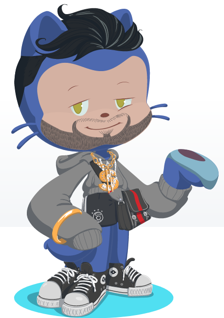

## 👋 Hello Devs! Welcome to my Github profile.

Tenho 23 anos, nasci no interior do Maranhão, mas moro em João Pessoa na Paraíba. Sou apaixonado por programação, aviação e meu estilo musical favorito é o rock com destaque para Pink Floyd. Estudo na escola de programação Trybe, estou cursando o módulo de Desenvolvimento Back-end e já conclui os módulos de Fundamentos do Desenvolvimento Web e Desenvolvimento Front-end e o que mais amo na programação é poder sempre estar me desafiando.

- 🌱 Atualmente estou aprendendo **Node.js**

- 🎮 Sou team PlayStation, mas atualmente jogo mais jogos mobile.

- 💬 Pergunte-me sobre **JavaScript**

### 🖥️ Tecnologias e Ferramentas: 

  
  
  
  
  
  
  
 
  
   
  

  
### Contatos:

  

  <a href="https://github.com/itaji-create">
  
  

